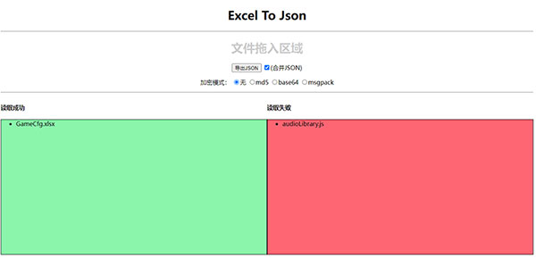

# ExcelToJson
主要用于XLSX、XLS转JSON工具。

1.支持批量导出json

2.多个xlsx合并为一个json

   
    
    
## 使用：
   1.下载代码包
   
      git clone https://github.com/xiaodao369/ExcelToJson.git
   
   2.打开index.html
   
   3.拖拽xlsx到页面

## 1.0.0
   ● 支持导出合并为一个JSON
   
   ○ 加密模式暂未开发
